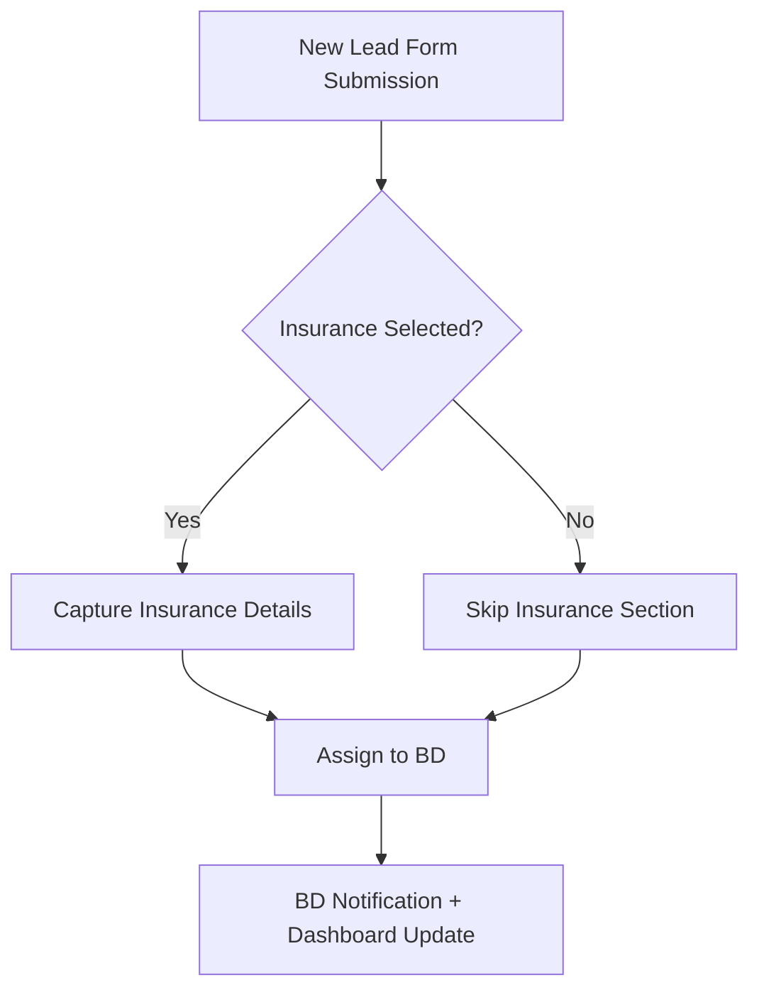

# O Positive Health CRM

## 📌 Table of Contents

1. [Overview](#overview)
2. [Authentication](#authentication)
3. [Modules](#modules)
   - [Lead Management](#lead-management)
   - [Employee Management](#employee-management)
   - [Partners Management](#partners-management)
   - [Doctor Management](#doctor-management)
   - [Cab Scheduling](#cab-scheduling)
   - [Insurance & Reimbursements](#insurance--reimbursements)
   - [Hospital Management](#hospital-management)
   - [Infrastructure & Finance](#infrastructure--finance)
   - [Loans Module](#loans-module)
4. [Forms and Data Structures](#forms-and-data-structures)
5. [Communication Integration](#communication-integration)
6. [Incentives & Salary](#incentives--salary)
7. [Document Uploads](#document-uploads)
8. [Mermaid Diagrams](#mermaid-diagrams)
9. [Notes & TODOs](#notes--todos)

---

## 🧾 Overview

This CRM is designed for **O Positive Health** and includes:

- Full-stack CRM for managing leads, employees, hospitals, partners, doctors, logistics (cab), loans, insurance, finance, and reimbursements.
- OTP-based login and multi-channel communication (WhatsApp, Email).
- Deep integration with document uploads and insurance validation.

---

## 🔐 Authentication

### Login Options

- **User ID + Password**
- **OTP Login** (OTP sent to both **email** and **mobile**)
- **Employee ID**
- **Forgot Password** flow (via email/mobile)

---

## 🧩 Modules

### 🎯 Lead Management

#### Dashboard Fields

- Today’s OPD/IPD
- Total OPD/IPD
- All Leads
- Follow-ups
- New Leads
- Sales Performance
- Monthly Target
- Achievements
- Total Doctors, Hospitals, Subscriptions, Loans, and Cabs

#### Lead Form Fields

| Field                         | Type     | Editable | Required |
|------------------------------|----------|----------|----------|
| Patient ID                   | Text     | Yes      | No       |
| Patient Name                 | Text     | Yes      | Yes      |
| Age, Gender, DOB             | Number/Text | Yes  | No       |
| Mobile Number, Email         | Text     | Yes      | Yes      |
| Treatment                    | Text     | Yes      | Optional |
| City                         | Text     | Yes      | Optional |
| Mode Of Payment              | Dropdown | Yes      | Optional |
| Lead Status (see below)     | Dropdown | Yes      | Optional |
| Description                  | Textarea | Yes      | Optional |
| BD Assign & Contact         | Text     | Yes      | Optional |
| OPD/IPD Status               | Dropdown | Yes      | Optional |
| Follow-up Date & Time        | DateTime | Yes      | Optional |
| Created & Assigned Timestamps | Auto   | No       | Auto     |
| Lead Created By              | Auto     | No       | Auto     |
| Insurance Status & Fields    | Section  | Yes      | Optional |
| Upload Documents             | Section  | Yes      | Optional |
| Aadhar, Pancard Number       | Text     | Yes      | Optional |
| Working Profession, Lead Source | Text | Yes  | Optional |
| Engagement Dates             | Date     | Yes      | Optional |
| Days to Close                | Auto     | No       | Auto     |
| Communication Options        | Actions  | Yes      | Optional |
| Address, Pincode, TPA, WhatsApp Number | Text | Yes | Optional |

> NOTE: All fields are editable except those marked as red (not specified in original document).

#### Lead Status Options

```text
New, DNP, Follow-up, Close, OPD Schedule, OPD Done, IPD Schedule, 
IPD Done, IPD Lose, Hot Lead, Cold Lead, Warm Lead, Irreverent, 
Fund Issue, Outside our Reach, Surgery Not Suggested, 
Enquired for Other Person
````

#### Insurance Status Fields

* Policy Type (Corporate/Individual)
* Policy Number, Employee Number
* Policy Inception & Validity Date
* Sum Insured, Insurance Company
* TPA Name, Employer Details
* Dependents, Job Title, Salary
* Primary Policy Holder Details
* Official Contact Info
* Upload Policy Documents

---

### 👥 Employee Management

#### Add New Member Form

* Name, Age, Gender
* Photo
* Personal Email, Mobile Number
* Address
* Previous Employer
* Highest Qualification
* Aadhar, Pancard Number
* Designation

#### View All Employees

* Tree View (Hierarchy)
* Each Node: Name, Photo, Designation
* On Click: Show Profile + Key Responsibilities (popup)

#### Other Features

* Leaves
* Reimbursement
* Incentives
* Resumes
* Loan Management (see below)

---

### 🤝 Partners Management

#### Partner Types

* Corporate
* Individual

#### Features

* Onboard new Partner/Corporate
* View All Partners
* Leads from Partners
* Invoices

---

### 👨‍⚕️ Doctor Management

#### Doctor Categories

* Doctors With Us
* Doctors with Self Clinic
* VC Doctors
* Department-wise
* City-wise

#### Functionalities

* Appointment Scheduling
* View All Doctors
* Doctors on Leave
* Generate Invoices

---

### 🚕 Cab Scheduling

#### Types

* Cab for OPD / IPD
* Cab for Employees / Doctors
* Scheduled Cabs
* Today’s Cabs

#### Cab Actions

* Booking
* Assignment
* Invoices

---

### 🛡️ Insurance & Reimbursements

* Reimbursement Forms
* OPD/IPD/EMI/Cabs/Medical Certificates
* Upload Bills
* Download Templates

---

### 🏥 Hospital Management

#### Features

* City-wise Hospitals
* Hospitals With Us
* Appointment Scheduling
* Invoices

---

### 🏗 Infrastructure & Finance

* Payments from Patients
* Marketing
* Finance
* Daily Debits/Credits
* GST Management
* Invoices:

  * Doctor
  * Cab
  * Hospital
  * Consumables
  * Salary/Incentives

---

### 💰 Loans Module

#### Loan Workflow

* All Loans
* New Loan Leads
* Loan Disbursement Letter
* Create New Loan
* Upload Documents
* Download Loan Process
* Pending Payments
* Loan Status

---

## 🧾 Forms and Data Structures

### Create New Lead Form

| Field            | Required |
| ---------------- | -------- |
| Name             | Yes      |
| Number           | Yes      |
| City             | No       |
| Treatment        | No       |
| Insurance Status | No       |
| Assign to BD     | No       |
| Description      | No       |

---

## ✉️ Communication Integration

### WhatsApp & Gmail Integration

* Send Custom Messages or Emails
* Select from Drafts
* Create New Draft Templates

> TODO: Define message format structure and template storage logic.

---

## 💵 Incentives & Salary

* Incentive Structure (Downloadable PDF)
* Salary Slips
* EMI Process

---

## 📎 Document Uploads

| Document Name                           | Required? |
| --------------------------------------- | --------- |
| Aadhar Card (Front + Back)              | Yes       |
| Pancard                                 | Yes       |
| Passport Size Photo                     | Yes       |
| Insurance Policy Card / Papers          | Optional  |
| Previous Reports & Prescriptions        | Optional  |
| OPD/IPD Reports                         | Optional  |
| Hospital IPD Bills                      | Optional  |
| Reimbursement Bills (Cab/Medicine/etc.) | Optional  |
| TPA Forms                               | Optional  |

---

## 🧮 Mermaid Diagrams

### Example: Lead Assignment Flow



---

## ❗ Notes & TODOs

> TODO: Define RBAC (Role-Based Access Control) for Admin, BD, Doctor, HR
> TODO: Define API contract and backend architecture for lead management
> TODO: Document expected integration points with third-party services (TPA, Gmail, WhatsApp, Insurance APIs)
> NOTE: Red-marked non-editable fields are referenced but not defined in the source — clarify with stakeholders.
> NOTE: No mention of database structure or tech stack. Requires architectural assumptions or follow-up.

---

Here is the **fully detailed Markdown documentation** extracted from your uploaded CRM platform PDF. It is structured for direct use by your **development team**, with **no information missed** and properly organized for implementation:

---

# 📘 CRM Platform — Developer Documentation

*Last updated: August 2025*
*CRM: O Positive Health*

---

## 🔐 Authentication & Login

### Login Options

* **User ID & Password**
* **Login with OTP** (Sent to Email and Mobile)
* **Employee ID login**
* **Forgot Password** (Recovery via Email and Mobile)

---

## 🧭 Navigation Modules

* Login
* Leads
* Doctors With Us
* Hospitals With Us
* Finance
* Human Resource
* Partners
* Cab
* Sales
* Upload / Download
* Loans
* My Profile

---

## 📊 Dashboard Metrics

Display KPIs:

* Total Loans
* Total IPD
* Total Doctors
* Total Hospitals
* Total Subscriptions
* Total OPD
* Total Cabs
* This Month’s Target
* Achievements
* Today’s OPD
* Today’s IPD
* New Leads
* Follow-ups for Today
* OPD/IPD Done
* All Leads

---

## 📁 Lead Management

### Lead Fields (Editable unless marked red)

| Field                           | Description                    |
| ------------------------------- | ------------------------------ |
| Patient ID                      | Auto-generated                 |
| Patient Name                    | Text                           |
| Age                             | Number                         |
| Gender                          | Dropdown                       |
| Date of Birth                   | Date                           |
| Mobile Number                   | Phone                          |
| Email                           | Email                          |
| Treatment                       | Text                           |
| City                            | Text                           |
| Mode of Payment                 | Cash / Insurance / EMI / Other |
| Lead Status                     | Dropdown (See below)           |
| Description                     | Free text                      |
| BD Assign                       | Employee ID                    |
| BD Contact Number               | Phone                          |
| OPD Status                      | Dropdown                       |
| IPD Status                      | Dropdown                       |
| Next Follow-up Date & Time      | DateTime                       |
| Lead Created Date & Time        | DateTime                       |
| Lead Created By                 | User ID                        |
| Lead Assigned To BD Date & Time | DateTime                       |
| Insurance Status                | Yes/No + Policy Info           |
| Upload Documents                | File Upload                    |
| Aadhar Card Number              | Text                           |
| Pancard Number                  | Text                           |
| Working Profession              | Text                           |
| Lead Source                     | Text                           |
| Date of First Engagement        | Date                           |
| Date of Last Engagement         | Date                           |
| Days to Close                   | Number                         |
| Send Message                    | Integrated via WhatsApp        |
| Send Email                      | Integrated via Gmail           |
| Address                         | Text                           |
| Pincode                         | Number                         |
| TPA                             | Name                           |
| WhatsApp Number                 | Phone                          |

---

### 🎯 Lead Status (Dropdown Options)

* New
* DNP
* Follow-up
* Close
* OPD Schedule
* OPD Done
* IPD Schedule
* IPD Done
* IPD Lose
* Hot Lead
* Cold Lead
* Warm Lead
* Irreverent
* Fund Issue
* Outside our Reach
* Surgery Not Suggested
* Enquired for Other Person

---

## 🛡️ Insurance Details

### Fields to Capture:

* Policy Type: Corporate / Individual
* Policy Number
* Employee Number
* Policy Inception Date
* Sum Insured
* Insurance Company Name
* TPA Name
* Employer / Company Name
* Company Address
* Name of Dependents
* Job Title
* Salary
* Primary Policy Holder Name
* Primary Policy Holder DOB
* Official Email ID
* Official Mobile Number
* Policy Valid Up To
* Upload Policy Card / Policy Papers

---

## 📤 Upload Documents

Required upload fields:

* Aadhar Card (Front + Back)
* Pancard
* Passport Size Photo
* Insurance Policy Docs
* Previous Prescriptions / Reports
* OPD Prescriptions (with us)
* IPD Hospital Bill
* Medicine / Cab / Other Reimbursement Bills
* TPA Reimbursement Paper

---

## ✉️ Communication

### WhatsApp & Gmail Integration

* Send Custom Messages or Emails
* Select from Drafts or Create New Drafts
* Ability to:

  * Create Message Templates
  * Save as Draft
  * Send to Patient or Insurance Handler

---

## ➕ Create New Lead (Form Fields)

* Name *(Mandatory)*
* Number *(Mandatory)*
* City *(Optional)*
* Treatment *(Optional)*
* Insurance Status (Yes/No) *(Optional)*
* Assign to BD *(Optional)*
* Description *(Optional)*

---

## 👥 Human Resources Module

### Key Sections

* Leaves
* Salary
* Reimbursement
* Loans to Employees
* All Employees
* Add New Member
* Incentive

### ➕ Add New Employee

* Name
* Age
* Gender
* Photo
* Personal Email
* Mobile Number
* Address
* Previous Employer
* Highest Qualification
* Aadhar Card Number
* Pancard Number
* Designation

### 👨‍💼 Employee Hierarchy

* Display as **Tree-like Structure**
* Fields:

  * Employee Name
  * Photo
  * Designation
* On click: Show popup with Profile & Key Responsibilities

### Metadata

* Total Employees
* Currently Working Employees

---

## 🧑‍⚕️ Doctor Management

* All Doctors
* Doctors With Us
* VC Doctors
* Doctors With Self Clinic
* Department-wise Doctors
* City-wise Doctors
* Doctors on Leave
* Appointment Scheduling
* Invoices

---

## 🏥 Hospital Management

* All Hospitals
* Hospitals With Us
* City-wise Listing
* Appointment Scheduling
* Hospital Invoices

---

## 🚕 Cab Management

### Types of Cab Services

* Cab for OPD
* Cab for IPD
* Cab for Employees
* Cab for Doctors
* Today's Cabs
* Scheduled Cabs
* Invoices

---

## 🤝 Partner & Corporate Module

* Onboard New Partner / Corporate
* View All Partners / Corporates
* Leads From Partners
* Invoices

---

## 💸 Finance & Invoicing

### Categories:

* Patient Payments
* Marketing
* Doctors Invoice
* Cab Invoice
* Salary / Incentives
* Hospital Invoice
* Consumables Invoice
* Daily Debits & Credits
* GST

---

## 🧾 Loan Management

### Loan Features

* All Loans
* Create New Loan Lead
* New Loan Leads
* Disbursement Letter Generation
* Loan Status
* Upload Documents
* Download Loan Process PDF
* Pending Payments

---

## 🧮 Incentives & Processes

* Incentive Structure
* Salary Slips
* EMI Process
* Insurance Process
* Insurance Reimbursement Forms
* Loan Process
* Download / Upload all forms

---

## 📎 Document Downloads

* Incentive Structure PDF
* Disease PDFs
* Loan Process Documents
* Salary Slips
* EMI Process
* Reimbursement Forms
* Insurance Process

---

## ✅ Notes

> * All columns in Lead Table are editable **except those marked in red**.
> * UI should allow for expandable sections for large data (e.g., patient history).
> * Integrate filters and search across all modules (especially Leads, Doctors, Cab, Finance).
> * Ensure Role-Based Access for HR, BD, Doctors, Finance Teams.

---
